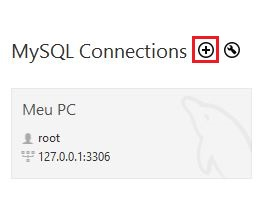
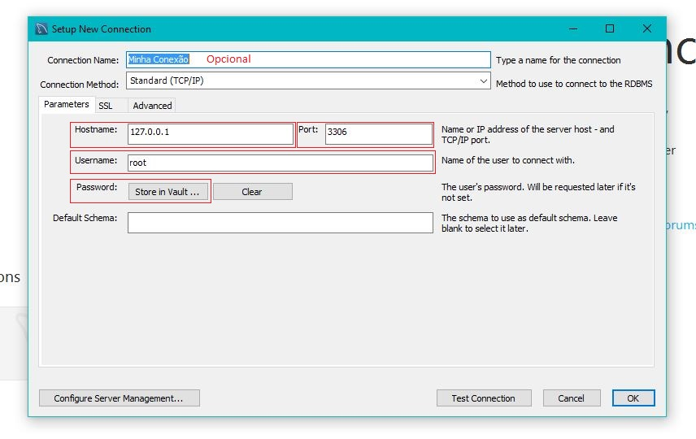
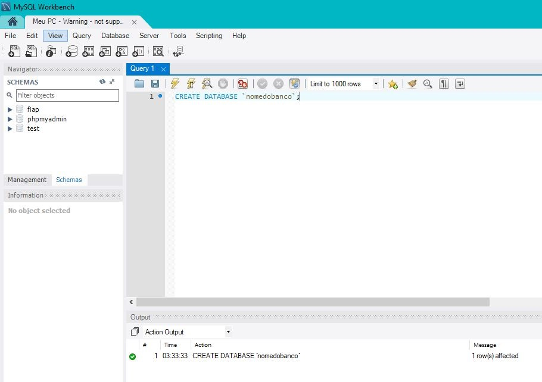
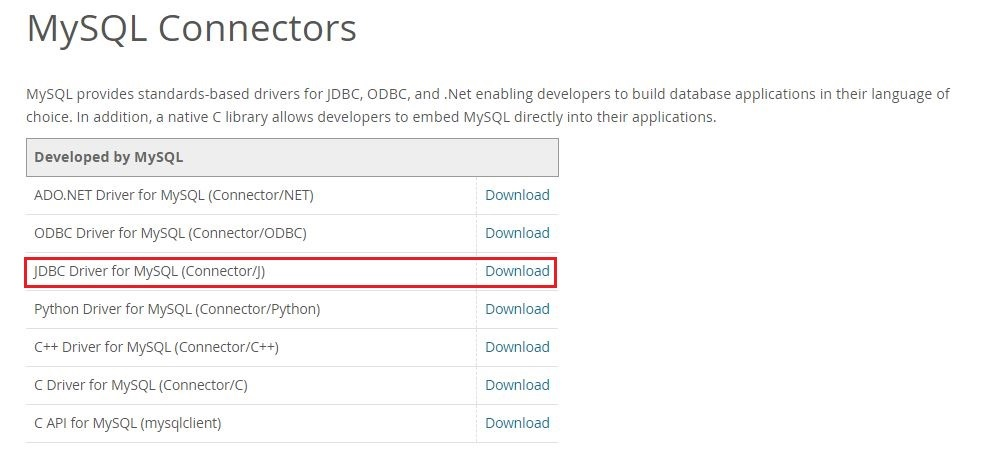
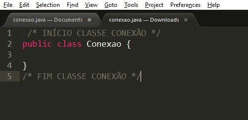
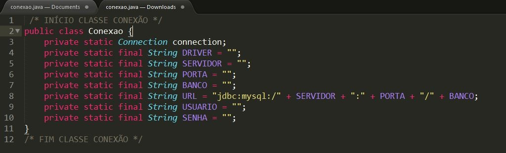
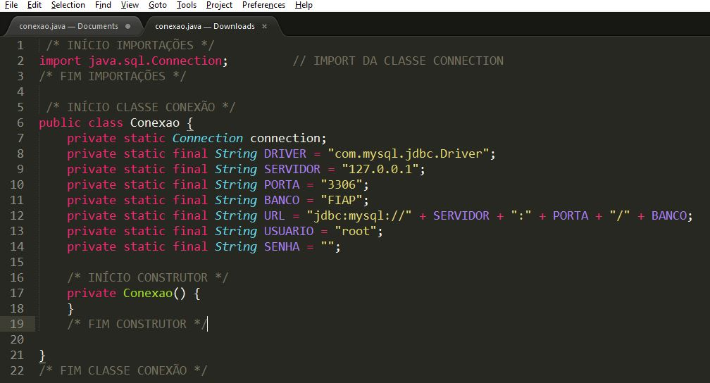

# TUTORIAL DE CONEXÃO COM BANCO DE DADOS MYSQL
#### Este repositório tem como objetivo ensinar de maneira detalhada o processo de conexão com banco de dados MySQL através da linguagem Java*

(caso você não tenha o seu MySQL Workbench configurado, siga esse tutorial: [Curso MySQL #02b - Instalando o XAMPP](https://www.youtube.com/watch?v=R2HrwSQ6EPM&list=PLHz_AreHm4dkBs-795Dsgvau_ekxg8g1r&index=3))


### 1) Crie uma conexão no MySQL Workbench ou obtenha os dados da conexão que deseja conectar






### 2) Guarde os dados da conexão

*(eles serão necessários paraa criação da classe de conexão)*
  * Hostname (IP do servidor)
  * Port (porta)
  * Usarname (usuario)
  * Password (senha)


### 3) Crie uma tabela no seu banco de dados (ou consiga o nome da tabela que deseja se conectar)

Clique na conexão criada e no script.sql aberto, digite e execute o seguinte comando:

```
CREATE DATABASE `nomedatabela`;
```
*(dê o nome que achar melhor para a sua tabela)*




### 4) Faça o download do driver de conexão com o banco MySQL, descompacte e adicione ao projeto

[Link para download do driver](https://www.mysql.com/products/connector/)



*(o processo de adição do driver de conexão ao projeto varia conforme a IDE utilizada, porém a forma mais fácil de realizar esse procedimento é clicar com o botão direito do mouse em cima do projeto e procurar algo como "adicionar bibliotecas" ou "add jar files"). 
Caso continue com dificuldade, pesquise no YouTube: "Adicionando Driver de Conexão MySQL nome-da-sua-ide".*


### 5) Na sua IDE ou editor de códigos, crie uma classe "Conexao.java"




### 6) Adicione as variáveis básicas da classe

*(utilize as informações de conexão com o banco que você guardou)*


 
 * `Connection connection` (variável que faz a conexão com o banco de dados)¹
 * `String DRIVER` (recebe endereço/local onde encontrar o driver de conexão)
 * `String SERVIDOR` (IP do servidor - *hostname*)
 * `String PORTA` (porta para conexão com o banco - *port*)
 * `String BANCO` (nome da sua tabela do banco de dados - *tabela que você criou*)
 * `String USUARIO` (nome de usuário criado - *user*)
 * `String SENHA` (senha do usuário - *password*)
 * `String URL` (caminho da conexão percorrido pelo java *conjunto de tudo*)²
 
 ¹*Será necessário importar o pacote java.sql.Connection;*
 
 ²*Imagine da seguinte forma: Você é o JDBC, seu objetivo é achar seu "amigo MySQL". No mundo real, para chegar a casa de alguém é necessário se um meio de transporte (driver de conexão) o endereço do local. O endereço (URL) é composto pela rua (servidor/hostname) e o número da casa (porta/port). Mas supondo que more mais de uma pessoa no mesmo número (muitos bancos de dados no mesmo servidor), aí seria necessário ter a letra/número (casa 1/casa A) da casa (banco/database). Ao chegar na casa do MySQL, se você for realmente amigo dele (usuário cadastrado/user) e souber a senha (password), ele vai te deixar entrar.*


### 7)  Adicione o método construtor
 
 
 
 O método construtor é privado para evitar ser invocado durante a codificação.
 
 
 ### 8)  Criação do método getConnection
